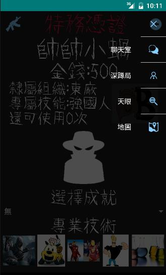
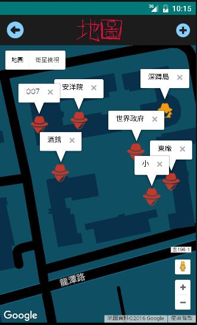
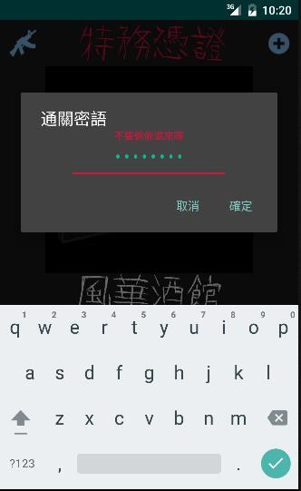
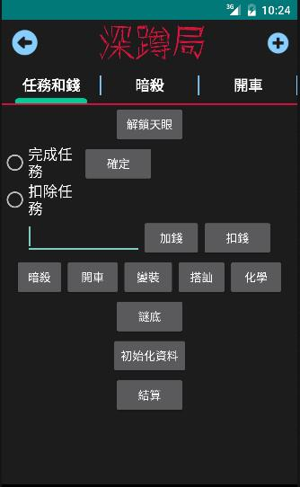

# YunTechCSIE-SuperOnline
這個APP是我在系學會舉辦的全校真人實境RPG寫的，可以讓參加者登入帳號，登入會會有每組的隊伍資訊，並能在遊戲中慢慢增加道具和技能，還有建立聊天室可以和其他隊伍聊天。
### APP進入畫面

### APP登入介面

### 隊伍資訊主畫面

### 功能選單

### 聊天室

### 地圖(使用GoogleMap API)

### 遊戲地點介紹(主畫面左右滑動能看到)

### 工人密碼驗證進入工人介面

### 工人操作介面

### 遊戲可獲得影片存放區

